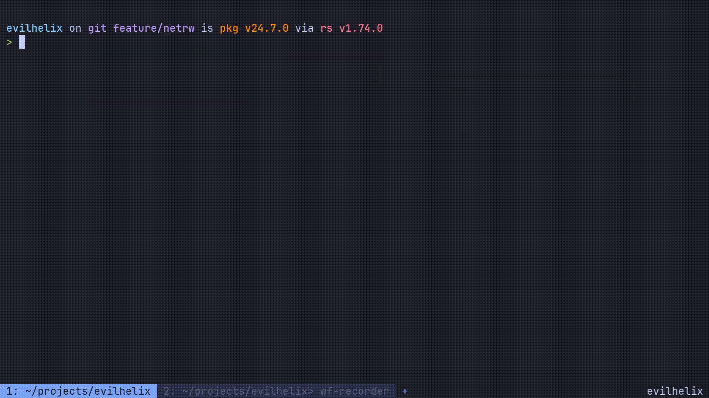

<h1>
Evil Helix
<!-- <picture> -->
<!--   <source media="(prefers-color-scheme: dark)" srcset="logo_dark.svg"> -->
<!--   <source media="(prefers-color-scheme: light)" srcset="logo_light.svg"> -->
<!--    -->
<!-- </picture> -->
</h1>

# Crude Netrw
I managed to put together a crude implementation of netrw that actually works pretty well.  The code is crude at the moment too, so there may be bugs.
## Why would I use this?
Often I find myself working on a file within a folder and I'd like to see the other files available within that same folder. In standard Helix you would have to
launch the file picker and search for the folder name (possibly even more specific if there's similarly named folders), which hopefully we can all argee is much slower than 
having this information presented to you in a neat buffer.
## How to use
Press `-` to open Netrw.  If pressed at a scratch pad, the working directory will be lauched that Helix was launched from.  If pressed while a file is focused,
it will open at the directory of that file.

You'll notice that `NORMAL` mode becomes `NETRW` mode and you see files and folders.  You can navigate just like any other buffer, but keys that would change text
or enter different modes have been disabled.

Press `enter` to open. If the line under your cursor is a directory, netrw will open that directory and you will remain within netrw.  If it's a file, that file will be opened and the netrw
buffer will close.
## Further goals
I'd like to figure out how to color the directories so that they stand out more.  I'd also like to place symbols in front of them like a folder or the icon for whatever
language the file is. The super long term goal would be to be able to edit the buffer and have it edit the actual file system like [oil.nvim](https://github.com/stevearc/oil.nvim)
does. I fear that Helix is not currently equipped for such asks... from what I can tell it's not very flexible from how the devs designed it and I don't know enough about
the project to build something like that from scratch.

# Project Goals
- Implement VIM motions as closely as possible
- Reuse Helix's already implemented functions as much as possible
- Integrate [lazygit](https://github.com/jesseduffield/lazygit) into Helix somehow (very long term goal)
- Integrate an [oil.nvim](https://github.com/stevearc/oil.nvim) style file browser (very long term goal)

# What works
## V-motions
- `v`
    - `w/W`
    - `b/B`
    - `e/E`
- `vi` (select inside textobject) and `va` (select around textobject)
    - `w/W`
    - `p`
    - treesitter objects 
        - `f` for function
        - `t` for type
        - `a` for argument
        - `c` for comment
        - `T` for test
    - pairs
        - `{`
        - `(`
        - `[`
        - etc

    > NOTE: The pairs matching first looks for any surrounding pair and if not found, will search for the next one forward

- `vt` and `vf`
    - i.e. `vt"` or `vT"` to select until `"` forward or backwards
    - i.e. `vf"` or `vF"` to select to `"` forward or backwards
    - using a count like `3vf"`
- `V` enters visual line mode

## D-motions
- `dd` deletes entire line
    - accepts counts like `3dd` to delete 3 lines
- `D` to delete from cursor to end of line
- `d`
    - `w/W`
    - `b/B`
    - `e/E`
- `di` (select inside textobject) and `da` (select around textobject)
    - `w/W`
    - `p`
    - treesitter objects 
        - `f` for function
        - `t` for type
        - `a` for argument
        - `c` for comment
        - `T` for test
    - pairs
        - `{`
        - `(`
        - `[`
        - etc

        > NOTE: The pairs matching first looks for any surrounding pair and if not found, will search for the next one forward

- `dt` and `df`
    - i.e. `dt"` or `dT"` to delete until `"` forward or backwards
    - i.e. `df"` or `dF"` to delete to `"` forward or backwards
    - using a count like `3df"`

## C-motions
- `C` to change from cursor to end of line
- `c`
    - `w/W`
    - `b/B`
    - `e/E`
- `ci` (select inside textobject) and `ca` (select around textobject)
    - `w/W`
    - `p`
    - treesitter objects 
        - `f` for function
        - `t` for type
        - `a` for argument
        - `c` for comment
        - `T` for test
    - pairs
        - `{`
        - `(`
        - `[`
        - etc

        > NOTE: The pairs matching first looks for any surrounding pair and if not found, will search for the next one forward

- `ct` and `cf`
    - i.e. `ct"` or `cT"` to change until `"` forward or backwards
    - i.e. `cf"` or `cF"` to change to `"` forward or backwards
    - using a count like `3cf"`

## Y-motions
- `yy` yanks entire line
    - accepts counts like `3yy` to yank 3 lines
- `y`
    - `w/W`
    - `b/B`
    - `e/E`
- `yi` (select inside textobject) and `ya` (select around textobject)
    - `w/W`
    - `p`
    - treesitter objects 
        - `f` for function
        - `t` for type
        - `a` for argument
        - `c` for comment
        - `T` for test
    - pairs
        - `{`
        - `(`
        - `[`
        - etc

        > NOTE: The pairs matching first looks for any surrounding pair and if not found, will search for the next one forward

- `yt` and `yf`
    - i.e. `yt"` or `yT"` to yank until `"` forward or backwards
    - i.e. `yf"` or `yF"` to yank to `"` forward or backwards
    - using a count like `3yf"`

## Misc
- Normal and Insert modes no longer selects as you go (removes Helix default behavior)
- Helix shows available options for keys as you press them
- `w/W`, `e/E`, and `b/B` all go to the correct spot of word
- `t` and `f`
    - i.e. `t"` or `T"` to move until `"` forward or backwards
    - i.e. `f"` or `F"` to move to `"` forward or backwards
    - using a count like `3f"`
- `S` to change entire line
- `$` to go to end of line
- `^` to go to first non-whitespace of line
- `0` to go to beginning of line
- `%` to go to matching pair beneath cursor

# What doesn't work/TODO
- Enter Visual mode by pressing `vv` because I haven't figured out how to set a timer to default to Visual mode if nothing is pressed immediately after `v`
- Currently there is no Visual Block mode because I think Visual mode combined with multicursor does the same thing
- Helix seems to add an additional block that the cursor can be moved to at the end of every line
- When using `dd` or `yy` commands, the cursor position is not kept
- Motions like `cip` or `cif` do not search for next occurence of paragraph or function
- Motions with pairs like `ci{` do not work with a count
- Comments
    - Implement `gcc` to comment in Normal mode
    - Implement `gc` to comment in Visual mode
    - Implement `gb` to block comment in Visual mode
- Probably lots of motions with counts that don't work
- Refactor evil functions to match Helix architecture (i.e. `_impl` functions)
- Refactor tests for new motions and behavior (very long term goal)

# Installation

[Installation documentation](https://docs.helix-editor.com/install.html).

<!--  -->

# Contributing

Contributing guidelines can be found [here](./docs/CONTRIBUTING.md).

I reserve the right to reject any suggestions or PRs for this fork.
